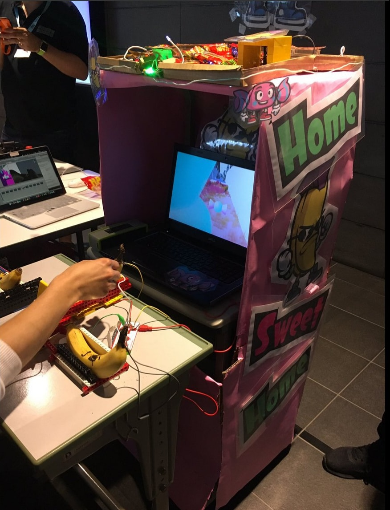
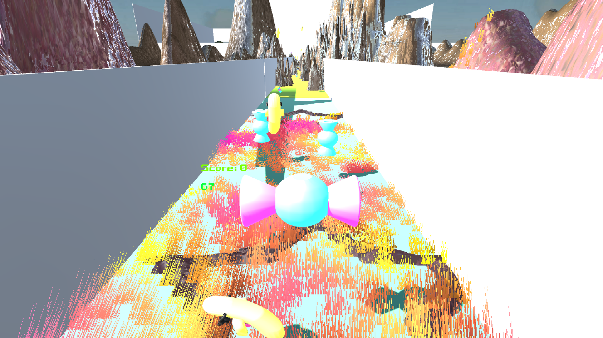
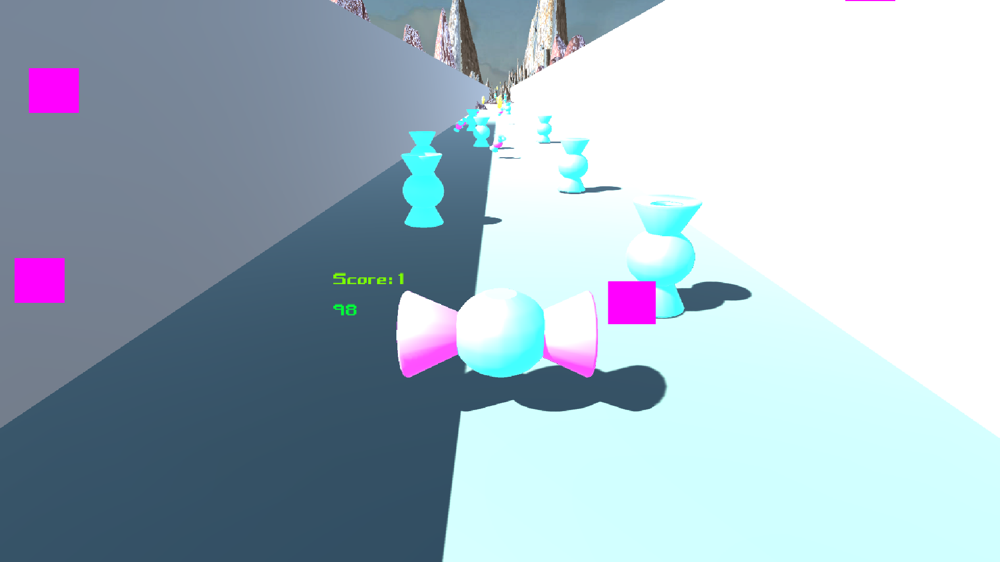

# Home-Sweet-Home 

Home-Sweet-Home or HSH is a Unity3D video game where you play as a candy who wants to get home. The objective is to collect as many candies as possible, while avoiding the banana enemies and getting home in under 100 seconds.

[Download on Mac, Windows or Linux](https://github.com/gg2001/hsh/releases/tag/v1.0). You can also play it [online](https://gg2001.github.io/kistcoders/hsh/play/), if you have HTML5 WebGL enabled.

HSH was created by members of the K. International School Programming Club. We won first place in the [Coding For Life](http://www.tokyosandbox.com/coding-for-life/) (high school only) arcade game competition at the [Tokyo Indie Fest](http://www.tokyosandbox.com/tokyo-indie-fest/) on Sunday May 14th 2017. We participated with the team name "K-IST Coders" and competed against 7 teams from 4 high schools in Tokyo. ([Interview](https://www.youtube.com/watch?v=vrjRR2MWY1E))

